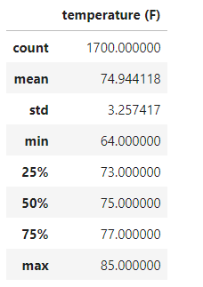
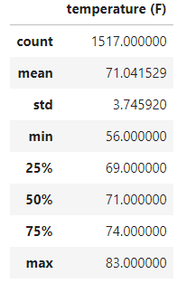

# surfs_up
Module 9

## Overview of Project
This project is an analysis of temperature data in Hawaii. The analysis utilizes a SQLite file, where SQLite is a relational database management system. In Jupyter Notebook, functions to read and interact with the .sqlite are imported from SQLAlchemy. Queries are written to the .sqlite in Jupyter Notebook.
### Purpose
The purpose of this file is to write queries to view all temperature data stored in the .sqlite by month. Because our temperature data spans multiple years, our query filter utilizes an extract function imported from sqlalchemy. For the first deliverable, a query written to the .sqlite is filtered with an extract function, returning Hawaii's temperature data spanning 2010 to 2017 for the month of June. Summary statistics are collected for this dataset. The steps are repeated for the month of December in the second deliverable; the temperature data for this dataset spans 2010 to 2016.
## Results
### Deliverable 1
Extract query & summary statistics https://github.com/stereo-chemistry/surfs_up/blob/e5422f98db35c58cd58460c984bc57323df5c499/resources/SurfsUp_Challenge.py#L63-L67

* The query  yields Hawaii's temperature data for the month of **June**
* The query yields a dataset of 1700 points
* The dataset spans 7 years 2010 to 2017
### Deliverable 2
Extract query & summary statistics https://github.com/stereo-chemistry/surfs_up/blob/e5422f98db35c58cd58460c984bc57323df5c499/resources/SurfsUp_Challenge.py#L97-L101

* The query yields Hawaii's temperature data for the month of **December**
* The query yields a dataset of 1517 points
* The dataset spans 6 years 2010 to 2016
  * .sqlite data begins 01/01/2010 and ends 08/23/2017 
## Summary
Comparing December to June, the mean, 25% quartile and 50% quartile are about 4 degrees F lower, the 75% quartile about about 3 degrees F lower, and the max about 2 degrees F lower. Comparing December to June, the most significant differences are the ~ 8 degree F lower minimum and slightly larger standard deviation, potentially suggesting less consistency in December's temperature. In order to gather more relevant weather data, an additional query can be performed to find precipitation for the months of June and December. Additionally, temperature and precipitation queries can be written to specify data from any particular weather recording station.
